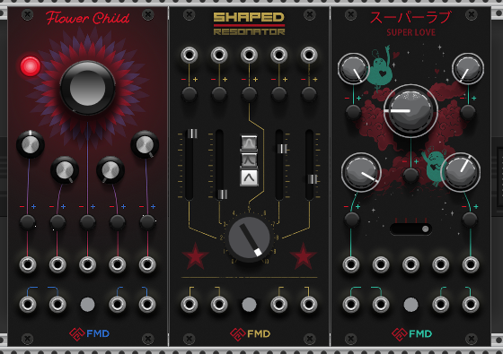
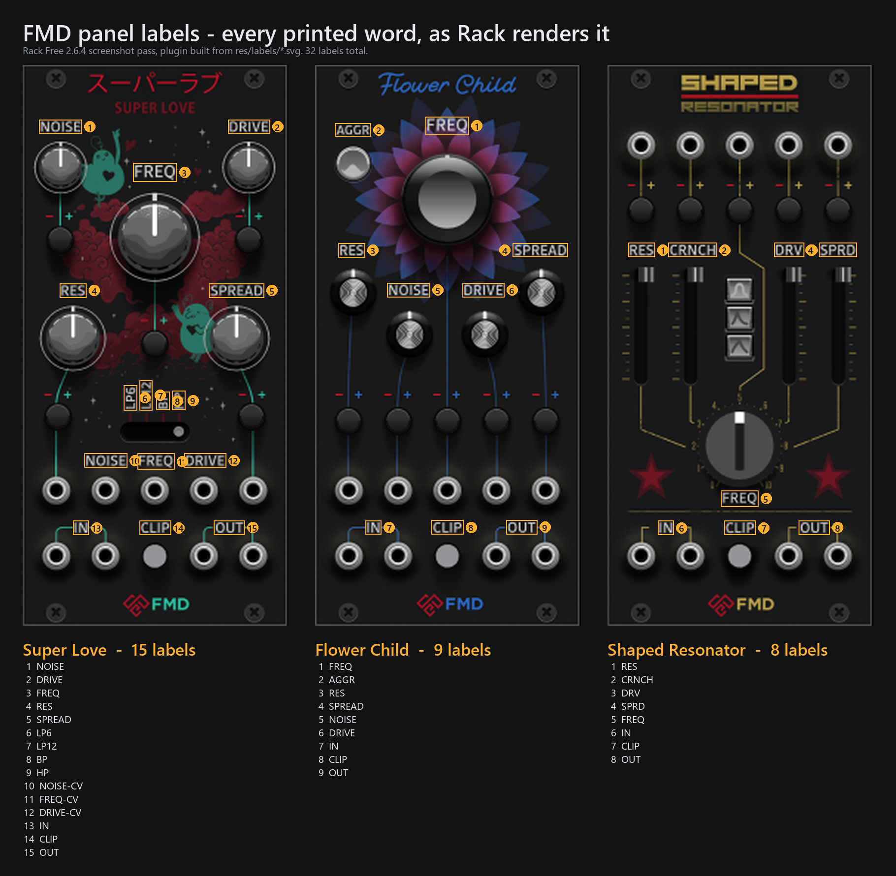

# FMD — VCV Rack collection

One plugin (`slug`: **FMD**), many modules. Super Love is the first that ships.
Flower Child and Shaped Resonator stay in the tree uncompiled until they are
ready. GitHub repo: `soundemote/soemdsp-vcvrack`. Rack slug stays `FMD`.

```
src/plugin.cpp              # registers shipped models only
src/common/                 # widgets, CV helpers, sandbox maths
src/modules/SuperLove/      # compiled
src/modules/FlowerChild/    # wip
src/modules/ShapedResonator/# wip
res/                        # per-module artwork; dist packs Super Love only
```

| Module | Status | Panel |
| --- | --- | --- |
| **Super Love** | ships | `res/panels/SuperLove.png` |
| **Flower Child** | wip | `res/panels/FlowerChild.png` (+ AGGR) |
| **Shaped Resonator** | wip | `res/panels/ShapedResonator.png` |

The brief's main goal — "getting knobs turning" — is met: every knob, fader,
button and slider is a live parameter driving audio, with tooltips, right-click
menus, undo/redo, CV and preset save/load working as Rack expects.



Above: all three loaded in Rack 2.6.4 from a patch with deliberately extreme
values, so the controls are visibly off their defaults — Flower Child on its
AGGR panel with the LED lit, the Shaped Resonator faders at four different
heights with the third shape button latched, and Super Love's mode slider at HP.

## Status

Builds clean against **Rack SDK 2.6.4** with `-Wall -Wextra -Wsuggest-override`,
no warnings. `make` and `make dist` both complete.

**Verified running in VCV Rack Free 2.6.4.** All three modules load, every panel
and control renders, and a patch with deliberately extreme parameter values
confirms the knobs rotate, the faders travel, the shape buttons latch, the mode
slider steps, and AGGR swaps Flower Child to its alternate panel with the LED
lit. The engine ran for ~20 s with all three modules instantiated at roughly 6%
CPU with no crash or blow-up.

Not verified: audio through a real sound device, and the plugin loading on macOS
or Linux.

**The panel labels are verified too.** Clean rebuild against Rack SDK 2.6.4 with
GCC 16.2, no warnings. All three label sheets load (`Loaded SVG …/res/labels/…`
in Rack's log, no warnings or errors), and Rack's own `-t` screenshot pass shows
every word rendering in the right place on all three panels — so nanosvg is
happy with the generated path data, and nothing came out as the black box that
an unfilled shape produces here.

The Flower Child swap was checked end to end with a patch holding RES=1,
NOISE=0, DRIVE=1, SPREAD=0: the knob under the printed **RES** sits hard
clockwise, **NOISE** hard counter-clockwise, **DRIVE** clockwise and **SPREAD**
counter-clockwise. Under the old wiring that picture would be mirrored.



Above: all 32 labels on Rack's own screenshot output — 15 on Super Love, 9 on
Flower Child, 8 on Shaped Resonator. Worth noting what the artwork does *not*
name: the fifteen attenuverters carry only `- +`, Flower Child's and Shaped
Resonator's CV jack rows are unlabelled entirely, and Super Love names only the
middle three of its five CV jacks. Those controls are identified by tooltip
alone. Printing them would be new artwork rather than a code change — once the
words exist in the type layers the pipeline picks them up, and `LABEL_INVENTORY`
in `prepare_assets.py` is the one place that would need the new names.

Note for anyone building on Windows with w64devkit: `make dist` produces a
**broken** `.vcvplugin`, because its busybox `tar` does not understand the
`--no-xattrs` flag the SDK passes — it prints its usage and the archive comes
out empty. `dist/FMD/` itself is built correctly, so copy that folder into the
plugins directory as described above rather than using `make install`. The SDK
also needs `jq` on PATH, which w64devkit does not ship.

Four defects were found and fixed by actually running it — see *Notes for the
next person* at the end.

## Building

You need the [Rack SDK](https://vcvrack.com/downloads/) and a MinGW-w64
toolchain (Windows), or the standard toolchain for your OS.

```sh
export RACK_DIR=/path/to/Rack-SDK
make            # -> plugin.dll
make install    # -> copies into the Rack user plugins dir
```

Or copy the prebuilt `dist/FMD/` folder straight into your Rack plugins
directory (`%LOCALAPPDATA%\Rack2\plugins-win-x64\` on Windows). That folder was
built here with GCC 16 (w64devkit) and `-static-libstdc++`; if it misbehaves,
rebuild with the official MSYS2 toolchain that VCV documents.

## Artwork pipeline

`tools/prepare_assets.py` regenerates everything in `res/` from
`../image assets/`. Re-run it whenever the design files change:

```sh
python tools/prepare_assets.py
```

The source artwork is authored at three different scales (mm, 72 dpi px, and
raw Serif px). The script rewrites every control SVG with an explicit rack-px
`width`/`height` plus a `viewBox` over its original coordinate space, so the C++
never applies a scale factor — a widget is simply as big as its SVG says.
Target sizes live in the `CONTROLS` table at the top of that file; that is the
one place to edit if a control looks too big or too small.

Two assets need more than a rescale:

- **`FaderPolivoks.svg`** is drawn portrait but sits on a vertical fader, where
  the handle must be wide and short — the script rotates it 90°.
- **Serif exports** (`KnobPolivoks*`, `KnobSL*`, `SliderHandle`) tag shapes with
  `serif:id`. The script carries every `xmlns:*` declaration across when it
  rewrites the `<svg>` element, otherwise those become unbound prefixes.

Panels are PNGs, taken from the 950 px (2.5×) exports. Rack loads images without
mipmaps, so a 4× source aliases badly at 1× zoom; 2.5× is the best trade.

### Labels

Those panel exports have their type layer switched off — there is no FREQ, RES,
NOISE, DRIVE, SPREAD, IN, CLIP or OUT anywhere on them, only the title art, the
fader slots and the `- +` attenuverter marks. Compare `res/panels/` against the
two mockups and every printed word is missing.

The labels were sitting unused in the `*-panel-type.svg` files beside the panel
exports. `prepare_assets.py` now rebuilds them into `res/labels/`, one sheet per
module, and `fmd::PanelLabels` draws each sheet over its panel as vector — so
the type stays sharp at any zoom, and Flower Child's two panel variants share
one sheet because only the raster underneath swaps.

The three design files are two different exports of the same idea:

- **Flower Child** is plain vector: `<g id="FREQ">`, `<g id="AGGR">` and so on,
  already `fill="#d3d3d3"`, every path carrying the same `translate()` that
  crops the page to the type bounding box. The generated sheet wraps them in the
  inverse translate to put them back in panel space.
- **Shaped Resonator** and **Super Love** are Illustrator's "text filled with an
  image": each label is a `<clipPath>` of glyph outlines with a full-page raster
  painted through it. Every one of those rasters turns out to be a blank white
  page with just the label region at `#d3d3d3`, so they carry nothing — the clip
  path outlines *are* the labels, and the colour is the same `#d3d3d3` that
  Flower Child states outright.

Rack's nanosvg supports neither `clipPath` nor `<image>` nor `<style>`, so none
of the source structure can ship. The generated sheets are a flat list of
`<path d= fill=>` in the source artboard's coordinate space, one `<g id>` per
printed label. They carry `preserveAspectRatio="none"`: the panel raster is
drawn stretched into Rack's 179 × 380 module rect, and without it nanosvg fits
the viewBox with a uniform scale and centres it, walking the type off the
controls by a fraction of a pixel.

Those clip paths are named `clippath-N`, so the label *text* is not recoverable
from the SR and SL files — `SR_LABEL_NAMES` and `SL_LABEL_NAMES` map id to the
word printed on the panel. `LABEL_INVENTORY` lists what each panel is supposed
to say, and the run fails loudly rather than shipping a panel with a word
missing. The counts are 9 / 8 / 15.

## Layout

Every control position is read straight out of the `positions.svg` files, which
mark each control with a crosshair. `tools/` extracted the bounding-box centre
of each crosshair and converted it into Rack's 179 × 380 panel space (12 HP).
The coordinates in the three module `.cpp` files are those values verbatim.

Which control each position *is* comes from the type layer, now that it is
rendered: every label sits about 29 px above the control it names, and on Shaped
Resonator and Super Love that confirms the existing assignment exactly — every
label centre lands within a pixel of its control's x.

On Flower Child it did not. The four voice knobs had been assigned by analogy
with the Super Love mockup, and the type layer says otherwise:

| Label (rack px) | Control the art names | Was wired to |
| --- | --- | --- |
| RES (24.9, 125.5) | outer left (25.86, 154.36) | NOISE |
| NOISE (63.4, 152.6) | inner left (64.08, 182.76) | RES |
| DRIVE (114.0, 152.6) | inner right (115.04, 182.76) | SPREAD |
| SPREAD (152.6, 125.5) | outer right (153.26, 154.36) | DRIVE |

RES and SPREAD are the outer pair, not the inner one. FREQ, AGGR, IN, CLIP and
OUT independently confirm the 29 px offset the table is read on, so RES ↔ NOISE
and DRIVE ↔ SPREAD are now swapped in `FlowerChild.cpp`. **This changes what
each knob does on Flower Child**, so a patch saved against the previous build
will sound different. The CV trimmer and jack columns are unlabelled on this
panel and keep Super Love's printed order — RES / NOISE / FREQ / DRIVE / SPREAD
left to right — which stays consistent with the corrected knobs above.

Two places where the source needed interpretation, both flagged in the code:

- **Super Love** marks 21 crosshairs but omits the SPREAD attenuverter. The
  panel art clearly prints a `- +` pair for it opposite the RES attenuverter, so
  it is mirrored about the panel centre (`179 − 23.94 = 155.06`).
- **Shaped Resonator** marks each fader handle at its *mockup value*, not at the
  centre of its slot. The slots are drawn on the panel from y=137 to y=215, so
  the faders are placed on that span.

Knob layers are numbered top-first in the source artwork (`01` is the topmost
overlay, the highest number is the base), which is why `prepare_assets.py`
reverses them and the `addLayer()` calls read bottom-up. The upper layers have
transparent centres, so the rotating skirt and cap below them stay visible.

## DSP

**Flower Child** uses the real Clean / Dirty algorithm from
`soemdsp-sandbox/native_modules/flower_child_filter` (modes 0 and 1). The port
lives in `src/FlowerChildFilter.hpp` with the sandbox maths helpers vendored
under `src/vendor/sandbox_native_maths/`.

| Panel | DSP |
| --- | --- |
| FREQ | Original 0..1 frequency slider (pitch map 3..161 inside the voice) |
| RES | Resonance 0..1 |
| NOISE | Chaos amount 0..1 |
| AGGR | Clean (Rev1 sine) ↔ Dirty (Rev2 ellipse, harder makeup) |
| DRIVE / SPREAD / CLIP | Panel-only: input gain, stereo freq detune, output soft ceiling |

Rev3 and Downsampled modes from the sandbox are not exposed.

**Shaped Resonator** and **Super Love** still use the placeholder TPT SVF in
`src/FmdDsp.hpp` until their sandbox ports are wired the same way.

CV is summed as `knob + volts × 0.1 × attenuverter` for the 0..1 controls.

## Notes for the next person

Four things broke on the first real launch. All are fixed, but they are the
traps in this codebase and worth knowing before adding a control:

1. **`Widget::box.size` defaults to `(INFINITY, INFINITY)`, not zero.**
   `LayeredKnob` and `FramesSwitch` grow their box to fit each layer, so they
   must reset it to `Vec()` in the constructor first. Miss this and the knob
   silently renders nothing and lands off-panel — no warning, no error.
2. **Rack's nanosvg has no clipPath support whatsoever.** Serif wraps its
   exports in `<clipPath><rect id="export"/></clipPath>`, and that rect has no
   fill, so nanosvg defaults it to black and paints a solid square over the
   control. `prepare_assets.py` strips clip paths.
3. **nanosvg understands the `style` *attribute* only** — no `<style>` element,
   no `class`. Illustrator's default export puts every fill and gradient in a
   stylesheet, which leaves those shapes unfilled and therefore black. This hit
   the Shaped Resonator buttons, the fader handle and the shape icons.
   `prepare_assets.py` flattens the stylesheet into inline style attributes.
4. **`Port::isConnected()` and `getVoltage()` are not const**, so helpers taking
   an input must take it by mutable reference.

Rack's `-t` screenshot mode builds module widgets with a **NULL module**, so
every knob renders at its drawn orientation regardless of value. It is good for
checking that artwork renders, useless for checking that knobs turn — use a
patch with real values for that.

## Still open

Cosmetic only, and the notes say the UI will be perfected later:

- **Knob sizes** were chosen from the two mockups, since the assets are authored
  at inconsistent scales. Adjust the `CONTROLS` table in `prepare_assets.py`.
- **Super Love's mode slider handle** (`KnobSLslider.svg`) is a 392×867 portrait
  shape scaled down to a 7×15 px thumb. It reads correctly, but the asset does
  not obviously match the short horizontal slot printed on the panel.
- **`KnobTrimmer-01-pointer.svg`** is not used. It is drawn on its own tiny page,
  so the offset that would place it away from the knob centre is lost; the turn
  layer already carries a visible indicator.
- **Fader and slider travel** are taken from the printed slots, so a handle may
  sit a pixel or two proud of the ends.
